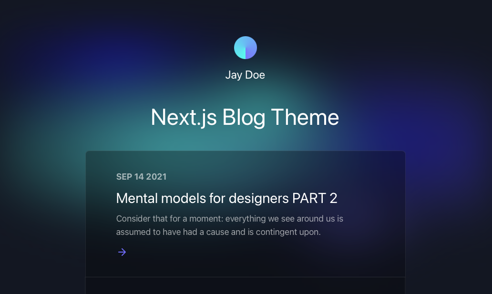

# Personal Blog — Next.js, MDX & Tailwind CSS

A statically generated personal blog built on the open-source [Netlify Next.js blog template](https://github.com/netlify-templates/nextjs-blog-theme) (designed by Bejamas). Posts are written in **MDX** (Markdown + React components), rendered at build time with syntax highlighting, and styled with **Tailwind CSS** in light and dark themes.



## Features
- Static site generation with Next.js: one page per post via `getStaticPaths` / `getStaticProps`
- Posts in MDX with front-matter (title, description, date) parsed by `gray-matter`
- Code highlighting with Prism (`@mapbox/rehype-prism`) and GitHub-flavoured Markdown (`remark-gfm`)
- Dark / light themes and colour presets via Tailwind (`themes.js`, `utils/tailwind-preset.js`)
- Blog name, title and footer configurable through environment variables
- End-to-end smoke test with Cypress; Netlify deployment config (`netlify.toml`)

## Tech stack
Next.js · React · MDX (`next-mdx-remote`) · Tailwind CSS · Prism · Cypress · Netlify

## Project structure
```
nextjs-blog-theme/
├── pages/
│   ├── index.js            # home page: list of posts
│   ├── posts/[slug].js     # one statically generated page per MDX post
│   ├── _app.js · _document.js
├── components/             # Layout, Header, Footer, SEO, links, icons
├── posts/                  # blog posts as .mdx files
├── utils/
│   ├── mdx-utils.js        # read + parse MDX posts, sort by date
│   ├── global-data.js      # blog name / title / footer (env-configurable)
│   └── tailwind-preset.js  # theme colours
├── styles/globals.css
├── cypress/e2e/            # end-to-end smoke test
├── docs/preview.png
├── themes.js · tailwind.config.js · postcss.config.js
└── netlify.toml
```

## Getting started
```bash
git clone https://github.com/kishorhange111/nextjs-blog-theme.git
cd nextjs-blog-theme
npm install
npm run dev            # http://localhost:3000
```

## Writing a post
Add a file to `posts/`, e.g. `posts/my-first-post.mdx`:
```mdx
---
title: My first post
description: What this post is about
date: 2026-09-24
---

Regular **Markdown**, code blocks, and React components.
```
The file name becomes the URL: `/posts/my-first-post`.

## Configuration
| Variable | Default |
|---|---|
| `BLOG_NAME` | Kishor Hange |
| `BLOG_TITLE` | Notes on ML & Software Engineering |
| `BLOG_FOOTER_TEXT` | All rights reserved. |

## Credits
Based on the [Netlify Next.js blog template](https://github.com/netlify-templates/nextjs-blog-theme) by Bejamas and Netlify (MIT licence — see `LICENSE`).
